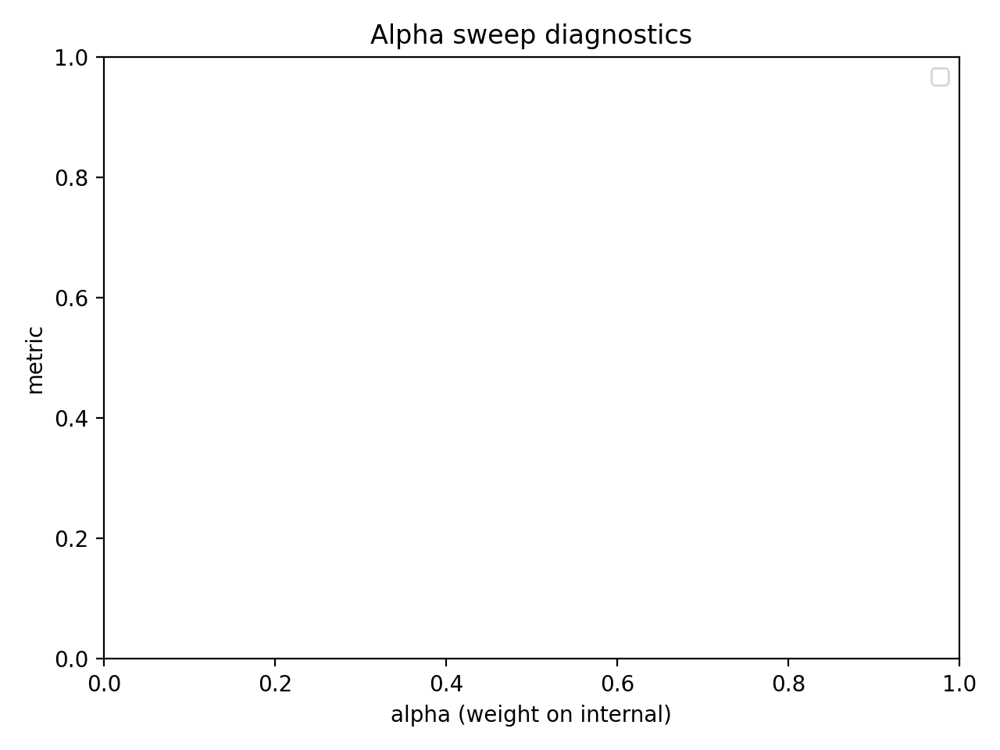
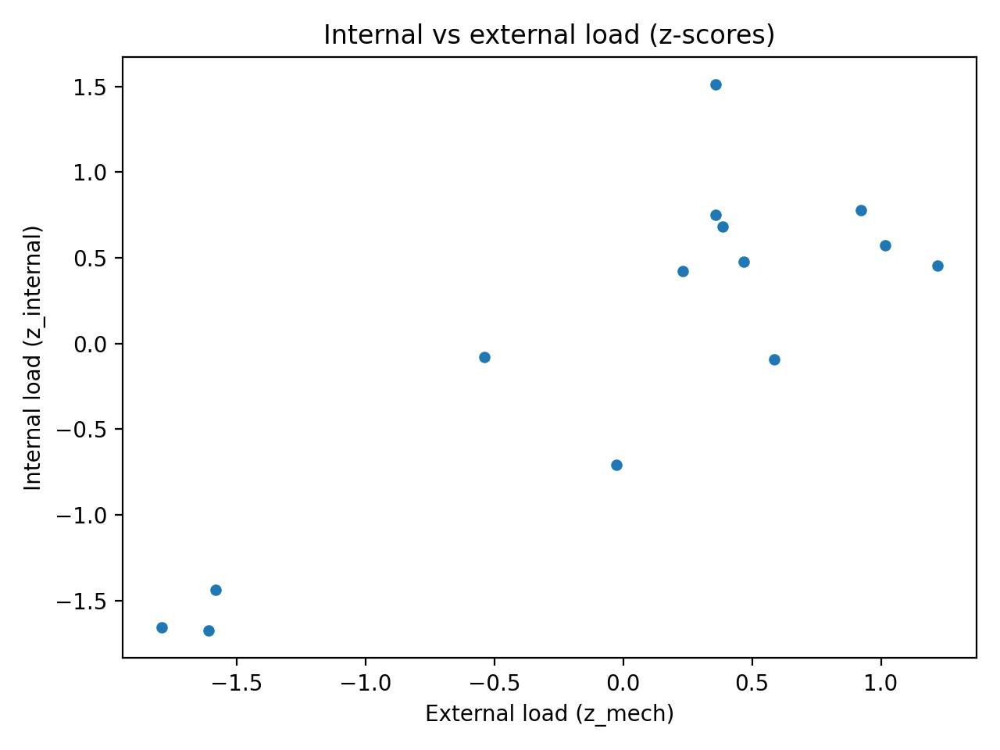

# SkiLoadLab — Reproducible Training Load Modeling for Downhill Skiing (Polar HR + GPX + DEM)

SkiLoadLab is a **research-oriented, reproducible pipeline** for estimating downhill-skiing training load by fusing:

- **Internal load** (heart-rate–based impulse / TRIMP variants)
- **External load proxies** (elevation drop & speed-derived mechanical intensity)

The repo is designed for **method development and figure-ready outputs**, not a consumer product.

---

## What this pipeline does

Given a skiing session (full mode: GPX + Polar HR + DEM) or an anonymized run-level demo table (demo mode), SkiLoadLab can:

1. parse GPX track and sample elevation from Copernicus DEM (GeoTIFF)
2. segment downhill runs (vs. lift / transitions)
3. align Polar HR stream to GPX time
4. compute internal load metrics (Edwards TRIMP + continuous HR impulse)
5. compute external load proxies (vertical drop, speed-based intensity)
6. compute a **combined load index**:
   \[
   CL(\alpha)=\alpha \cdot z_{internal} + (1-\alpha)\cdot z_{mech}
   \]
7. run **alpha sweep** to select an interpretable balance between internal/external contribution
8. generate publication-style figures

---

## Repository structure

- `src/` — core pipeline modules
- `scripts/` — runnable utilities (alpha sweep, figure generation, etc.)
- `data/example/` — anonymized demo CSVs (no raw GPS/HR)
- `docs/` — methods note + key figures for the GitHub page
- `output/` — local outputs (ignored by git)

---

## Quickstart (demo mode)

This repo ships an anonymized demo table that **does not include raw GPS/HR data**.
It is sufficient to reproduce figures and the alpha sweep logic.

### 1) Install
```bash
python3 -m venv .venv
source .venv/bin/activate
pip install -r requirements.txt

### 2) Demo: compute combined load (from demo table)

```bash
python3 src/model/combined_load.py \
  --in data/example/runs_final_example.csv \
  --out /tmp/demo_out.csv \
  --report /tmp/demo_report.json \
  --alpha 0.5

### 3) Demo: generate figures

```bash
python3 scripts/make_figures.py \
  --runs data/example/runs_final_example.csv \
  --out docs/figures \
  --pdf

## Key figures


