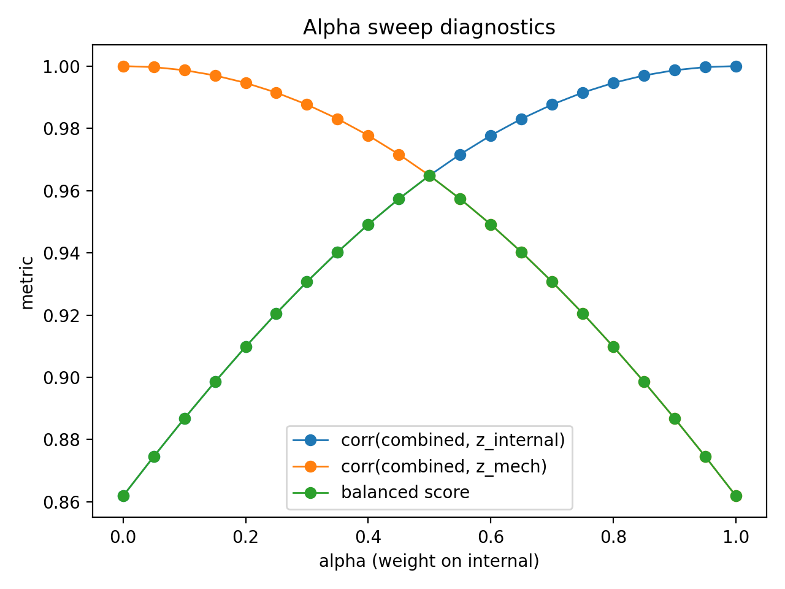

# SkiLoadLab: An Open-Source Software Toolkit for Reproducible Run-Level Training-Load Fusion in Alpine Skiing

## Summary
SkiLoadLab is an open-source Python toolkit for reproducible run-level training-load fusion in alpine skiing. The public software release is centered on a demo-compatible run-level workflow implemented through installable command-line tools for combined-load computation, alpha-sweep diagnostics, and publication-style figure generation. A central analytical component is an interpretable alpha-weighted fusion model, together with an alpha-sweep diagnostic that allows researchers to examine how the combined index changes across alternative internal-external weighting schemes. The repository also retains upstream utilities for GPX parsing, DEM-based elevation sampling, and heuristic run segmentation, but these are not the primary public reproducibility path. By exposing intermediate outputs, versioned releases, automated tests, and continuous integration, SkiLoadLab provides a transparent and privacy-preserving alternative to black-box training-load scoring systems for outdoor sports research.

## Statement of need
Quantifying training load in alpine skiing is challenging because physiological and mechanical demands are recorded by heterogeneous devices with different formats, clocks, and sampling structures, while commercial ecosystems often expose only proprietary summary scores. In field settings, training-load assessment is further complicated by GNSS uncertainty in mountainous terrain and the difficulty of separating downhill runs from lifts and transitions. These issues limit scientific reproducibility and methodological comparison.

SkiLoadLab addresses this gap as a research-oriented and reproducible software toolkit. Rather than attempting to reproduce every private device-processing step in a single public workflow, the current public release focuses on a stable run-level fusion workflow that can be reproduced from a demo-compatible table without exposing raw geolocation traces or identifiable physiological timestamps. This design keeps the core analytical contribution inspectable and testable while preserving a broader methodological context for research use.

## Software description

### Packaging and workflow design
SkiLoadLab is distributed as a modular Python package with documented command-line entry points for the public workflow. The maintained interface is exposed through the installable `skiloadlab` package and the commands:

- `skiloadlab-combine`
- `skiloadlab-alpha-sweep`
- `skiloadlab-make-figures`

These entry points provide the primary public reproducibility path for generating fused load tables, alpha-sweep summaries, and publication-style figures.

The repository also retains utilities related to broader research workflows, including GPX parsing, DEM elevation sampling, and heuristic run segmentation. These upstream components are useful for method development and internal research pipelines, but they are not the primary public reproducibility path described in the documentation or validated in continuous integration.

### Public reproducibility scope
The public reproducibility workflow is based on an anonymized run-level table that already contains the standardized internal and external components required for fusion. Readers can therefore reproduce the main software outputs without access to raw GPS trajectories, raw DEM rasters, or identifiable heart-rate timestamps.

In the maintained public workflow:

- `skiloadlab-combine` produces the combined run-level table
- `skiloadlab-alpha-sweep` produces the alpha-sweep summary
- `skiloadlab-make-figures` consumes those intermediate products to generate the figure set

This scope supports both transparency and privacy: users can inspect the software logic, reproduce the reported figures, and validate the command-line workflow without distributing sensitive raw sensor streams.

### Core modeling: the CL(alpha) framework
The core analytical model combines standardized internal and external components into a transparent fused index:

`CL(alpha) = alpha * z_internal + (1 - alpha) * z_mech`

Here, `z_internal` denotes the standardized internal-load component and `z_mech` denotes the standardized external/mechanical component. The parameter `alpha` in `[0, 1]` controls the relative emphasis assigned to physiological versus mechanical information.

This formulation is intentionally interpretable. Rather than introducing a black-box score, SkiLoadLab exposes the weighted contribution of its constituent components and preserves intermediate outputs for downstream inspection.

### Alpha-sweep diagnostics
A key feature of SkiLoadLab is an alpha-sweep diagnostic over `alpha in [0, 1]`. Instead of prescribing a universal optimal weight, the sweep is intended as a sensitivity-analysis framework for examining how the combined index changes as emphasis shifts between internal and external load components.

One practical summary is to inspect how strongly the fused index correlates with each constituent across the sweep. A balance-oriented diagnostic can be obtained by identifying the value of `alpha` that maximizes the smaller of the two constituent correlations. In the demonstration workflow used here, this diagnostic occurred near `alpha ~= 0.50`, indicating that the combined index was similarly aligned with physiological and mechanical components in that specific example. This result should be interpreted as dataset-specific and illustrative, rather than as a universal weighting rule.

### Outputs and quality control
SkiLoadLab produces explicit output artifacts rather than only final summary scores. These outputs include:

- run-level CSV tables
- JSON summaries of parameter settings and diagnostics
- publication-style figures for reporting and inspection

In the maintained public workflow, the key chained artifacts are the combined-load table, the alpha-sweep summary, and the figure set derived from those two intermediate products.

The repository includes automated tests and GitHub Actions continuous integration to reduce regressions and strengthen confidence in the public release. The documented public workflow has been validated through package installation, command-line execution, and automated tests across macOS, Windows, and GitHub Actions continuous-integration environments.

## Impact
The primary contribution of SkiLoadLab is not high-performance computing in itself, but a transparent and reusable research workflow for run-level training-load modeling. In contrast to opaque proprietary load scores, the software exposes intermediate variables, preserves analysis steps in code, and allows users to inspect how the fused metric behaves under alternative weighting assumptions.

Researchers can reproduce the same outputs from documented commands, compare fusion behavior across datasets, and incorporate the generated tables and figures into method-focused reporting. In the benchmarked public demo workflow, median wall-clock execution time was approximately 1.28 s on an Apple Silicon ARM64 system. This benchmark refers to the demo-compatible public workflow rather than to a fully packaged raw-sensor end-to-end pipeline.

## Availability
- Source code: https://github.com/YangchenxiWu/SkiLoadLab
- License: MIT
- Zenodo concept DOI: https://doi.org/10.5281/zenodo.19108568
- Zenodo version DOI (v0.1.2): https://doi.org/10.5281/zenodo.19110471

The public release is intentionally centered on a privacy-preserving demo-compatible run-level workflow. Raw trajectories containing precise geo-locations and identifiable physiological timestamps are not required for the maintained public reproducibility path.

## Limitations and future work
Several limitations should be stated explicitly:

- the public release is centered on a demo-compatible run-level workflow rather than a fully packaged public pipeline from raw GPX and heart-rate exports to final fused outputs
- run segmentation in outdoor skiing remains partly heuristic because downhill runs, lift phases, and transitions are not always separable by a single universally valid rule
- alignment between relative-time heart-rate exports and absolute-time GPX records may still require practical timestamp anchoring
- the alpha-sweep balance point is an interpretability-oriented diagnostic rather than a universally validated optimal parameter

Future work will focus on extending the framework rather than reframing its purpose. Planned directions include incorporating subjective effort measures such as rating of perceived exertion (RPE), improving drift handling in multi-sensor alignment, and refining configurability for segmentation heuristics across different skiing contexts.

## References
Impellizzeri, F. M., Marcora, S. M., & Coutts, A. J. (2019). Internal and external training load: 15 years on. International Journal of Sports Physiology and Performance, 14(2), 270-273.

Halperin, I., Vigotsky, A. D., Foster, C., & Pyne, D. B. (2018). Strengthening the practice of exercise and sport-science research. International Journal of Sports Physiology and Performance, 13(2), 127-134.

Gilgien, M., Spörri, J., Chardonnens, J., Kröll, J., & Müller, E. (2013). Determination of external forces in alpine skiing using a differential global navigation satellite system. Sensors, 13(8), 9821-9835.

Supej, M., Spörri, J., & Holmberg, H.-C. (2020). Methodological and practical considerations associated with assessment of alpine skiing performance using global navigation satellite systems. Frontiers in Sports and Active Living, 1, 74.

Harris, C. R., et al. (2020). Array programming with NumPy. Nature, 585(7825), 357-362.

McKinney, W. (2010). Data structures for statistical computing in Python. Proceedings of the 9th Python in Science Conference, 56-61.

Gillies, S., et al. Rasterio: Fast and direct raster I/O for use with NumPy. https://rasterio.readthedocs.io/

Edwards, S. (1993). The Heart Rate Monitor Book. Polar CIC.
